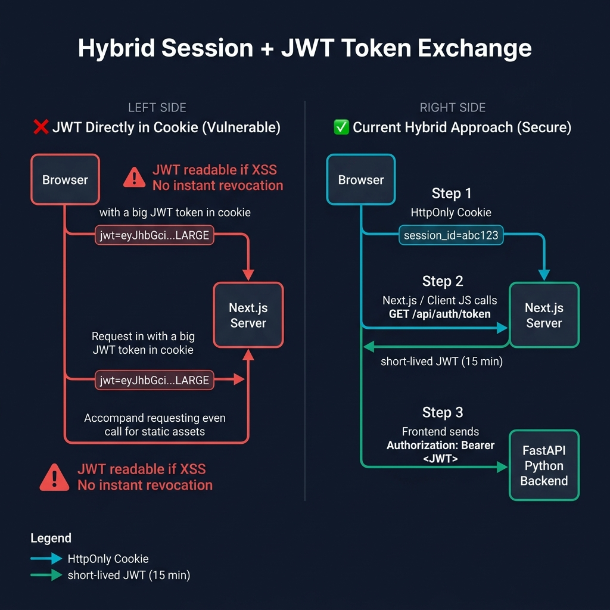
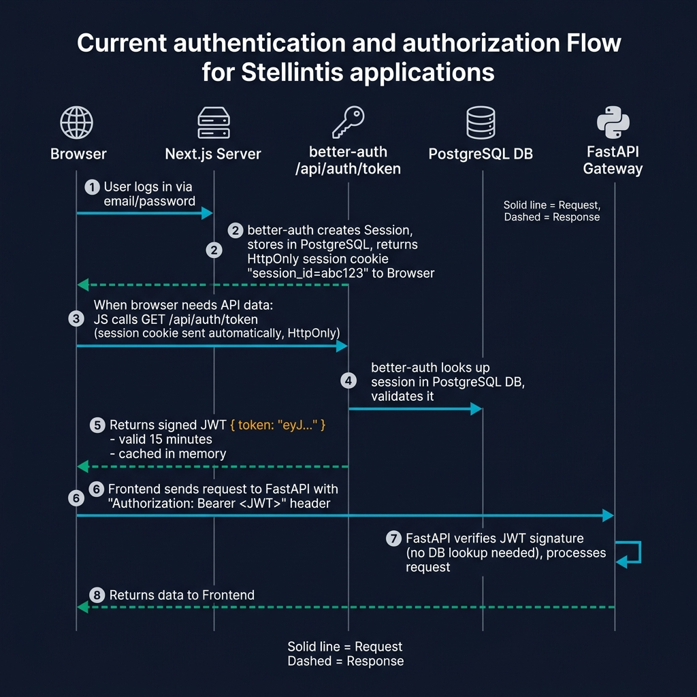

# Authentication Strategy: Why We Use a Hybrid Session + JWT Approach

> **Document Type:** Architecture Decision Record (ADR)  
> **Date:** March 2026  
> **Project:** Stellantis — Next.js + FastAPI Application  
> **Status:** Active

---

## Overview

This document explains the authentication and authorization strategy used in this application and justifies why the **Hybrid Session Cookie + JWT Token Exchange** approach was chosen over storing a JWT directly in a browser cookie.

Our stack consists of a **Next.js** frontend served by a Node.js server and a separate **FastAPI (Python)** backend gateway. These two services live on different logical layers, which demands a modern, decoupled authentication strategy.

---

## Architecture Diagrams

### Approach Comparison

The diagram below illustrates the key difference between storing a JWT directly in a browser cookie (left, insecure) versus our current hybrid approach (right, secure).



### Current Authentication & Authorization Flow

The sequence diagram below shows the exact steps taken from user login through to an authenticated API call.



**Step-by-step breakdown:**
1. User submits email/password credentials to the Next.js server.
2. `better-auth` validates credentials, creates a server-side session in **PostgreSQL**, and returns a small, `HttpOnly` session cookie (`session_id`) to the browser.
3. When the frontend needs to call the FastAPI backend, JavaScript first calls `GET /api/auth/token`.
4. `better-auth` validates the session cookie against the database.
5. A short-lived, cryptographically signed **JWT** (valid 15 minutes) is returned and cached in memory.
6. The frontend sends `Authorization: Bearer <JWT>` with every backend request.
7. FastAPI verifies the JWT's signature statically — **no database lookup required** — and processes the request.

---

## Approach 1: JWT Directly in Browser Cookie

In this simpler approach, after login the server signs a JWT and sets it directly in a browser cookie. That cookie is then sent on every request.

### ✅ Pros
- Simple to implement — single token serves all purposes.
- No extra round-trip to exchange the session for a JWT.
- Works well for monolithic apps with a single backend server.

### ❌ Cons
| Issue | Description |
|---|---|
| **XSS Vulnerability** | To use the JWT in an `Authorization` header, JavaScript must be able to read it — meaning the cookie **cannot** be `HttpOnly`. Any XSS attack can steal the token. |
| **No Instant Revocation** | JWTs are stateless. Even after a user logs out, a stolen long-lived JWT remains valid until its `exp` claim is reached (potentially hours or days). |
| **Cookie Bloat** | JWTs carrying roles, permissions, and metadata can reach several KB and are sent with **every request** to the server — including static asset requests — degrading performance. |
| **Cross-Domain Friction** | Cookies are bound to a domain. Sharing authentication across a Next.js server and a separate Python API (especially if on different subdomains or hosts) requires complex CORS and cookie-domain configuration. |
| **CSRF Exposure** | Cookies are sent automatically by the browser, requiring careful `SameSite` and CSRF-token configuration to avoid Cross-Site Request Forgery attacks. |

---

## Approach 2: Hybrid Session + JWT Token Exchange (Current)

Our approach separates concerns: **the browser holds a secure session reference**, and the **JavaScript application exchanges it for a short-lived JWT** only when it needs to call the backend.

This is implemented using the `jwt()` plugin from `better-auth`.

```typescript
// frontend/src/server/better-auth/config.ts
export const auth = betterAuth({
  database: new Pool({ connectionString: env.DATABASE_URL }),
  emailAndPassword: { enabled: true },
  plugins: [
    jwt() // Enables the GET /api/auth/token endpoint
  ]
});
```

```typescript
// frontend/src/core/api/auth-fetch.ts — Token Exchange Logic
async function fetchJwtToken(): Promise<string | null> {
  const res = await fetch("/api/auth/token", {
    method: "GET",
    credentials: "include", // Sends the HttpOnly session cookie automatically
  });
  const data = await res.json();
  return data?.token ?? null; // Returns a short-lived JWT for the backend
}
```

### ✅ Pros
| Benefit | Description |
|---|---|
| **XSS Protection** | The session cookie is `HttpOnly` — JavaScript can **never** read it. Token theft via script injection is blocked by the browser at the OS level. |
| **Instant Revocation** | Deleting the session from PostgreSQL immediately invalidates access. The next token exchange call will fail, even if the 15-minute JWT hasn't expired yet. |
| **Minimal Cookie Footprint** | The `session_id` cookie is ~32 characters. No payload bloat on every request. |
| **Stateless Backend** | The FastAPI backend validates JWTs using only a cryptographic signature — no database call per request. This enables horizontal scaling and high throughput. |
| **Clean Decoupling** | Next.js handles identity (sessions). FastAPI handles resources (data). Each service is independently scalable and testable. Standard `Bearer` token auth means any future service (Go, Rust, another Python app) can be added with zero auth changes. |
| **14-Min In-Memory Cache** | The JWT is cached client-side in memory (not in storage), minimizing `/api/auth/token` round-trips while still rotating tokens regularly. |

### ❌ Cons
| Trade-off | Description |
|---|---|
| **Extra Complexity** | Requires understanding of two token types (session + JWT) and a token refresh/caching mechanism. |
| **Additional Latency** | On cache miss (first request or after 14 min), an extra HTTP call to `/api/auth/token` adds a small round-trip before the main API call. |
| **In-Memory Cache Ephemerality** | The cached token lives in the JS runtime. A page refresh clears it, triggering a fresh exchange on the next API call. |

---

## Security Comparison Summary

| Security Property | JWT in Cookie | **Hybrid Approach (Current)** |
|---|---|---|
| **XSS Token Theft** | 🔴 Vulnerable (requires readable cookie) | 🟢 Protected (HttpOnly session) |
| **Instant Revocation** | 🔴 Not possible | 🟢 Supported (delete DB session) |
| **CSRF Protection** | 🟡 Requires explicit mitigation | 🟢 Built-in via SameSite cookie |
| **Cookie Size / Performance** | 🔴 Large cookie on every request | 🟢 Tiny session ID only |
| **Backend Scalability** | 🟡 Requires shared session store or JWT | 🟢 Stateless JWT verification |
| **Cross-Service Auth** | 🔴 Domain-tied cookie friction | 🟢 Standard Bearer token |
| **Implementation Complexity** | 🟢 Simple | 🟡 Moderate |

> **Overall Assessment:** The one-time complexity cost of the hybrid approach is justified by significant gains in security, scalability, and architectural cleanliness — especially given our decoupled Next.js + FastAPI stack.

---

## Industry Alignment

This approach aligns with modern security standards and is used in production by companies operating decoupled frontend/backend stacks:

- **OWASP** recommends `HttpOnly`, `Secure`, and `SameSite` cookie attributes as the first line of defense against session hijacking.
- **OAuth 2.0 Token Exchange** (RFC 8693) formalizes the concept of exchanging a primary token for a scoped downstream token — exactly what our `/api/auth/token` endpoint implements.
- **`better-auth`'s own documentation** states the JWT plugin is purpose-built for this exact use case: obtaining JWTs for microservices and external API calls from a secure session-based identity layer.
- Best practice guides consistently recommend against storing JWTs in `localStorage` or readable cookies, which this approach enforces by design.

---

## Files Reference

| File | Purpose |
|---|---|
| `frontend/src/server/better-auth/config.ts` | Configures `better-auth` with `jwt()` plugin |
| `frontend/src/server/better-auth/server.ts` | Server-side session helper (`getSession`) |
| `frontend/src/core/api/auth-fetch.ts` | Token exchange logic, 14-min cache, `fetchWithAuth` helper |
| `backend/packages/auth/jwt_auth/__init__.py` | FastAPI JWT verification dependency |
| `backend/app/gateway/dependencies.py` | Injects `get_current_user` into gateway routes |
