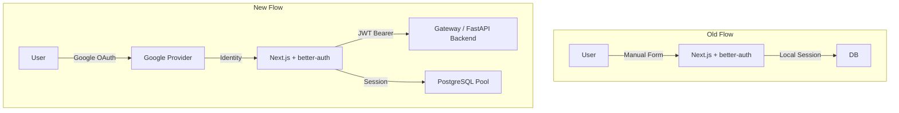
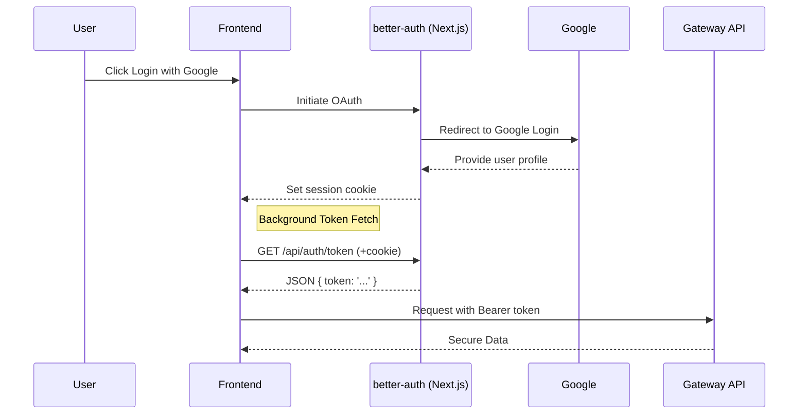

## Summary
Refactored the authentication system to remove manual email/password registration and login, transitioning to a streamlined **Google OAuth** flow. This update enhances security and simplifies the user experience by leveraging standard identity providers.

## Key Changes
- **Authentication Backend**: Configured `better-auth` with Google Social Provider and disabled `emailAndPassword`.
- **JWT Integration**: Implemented the `jwt()` plugin in `better-auth` to facilitate secure communication between the frontend and backend.
- **Auth Client**: Introduced `auth-fetch.ts` with a `fetchWithAuth` helper that manages token retrieval, caching, and injection into outgoing requests.
- **Database**: Migrated session storage to a PostgreSQL pool using `pg` for better concurrency and reliability.
- **UI/UX**: Updated the landing and login pages to focus purely on the OAuth flow.

## Architecture Comparison

## Authentication Flow

